

     
    <b>QS Task.</b> System, built using Java, Java Spring, JDBC Template, Thymleaf,and Maven.

## Features
* **Customer:**
    * Login
    * Registration
    * Profile view and modify
    * Browse and search products
    * Add own products
* **Administrator:**
    * Add and remove users
    * Modify user details
    * View user list

## Tools & Technologies
* Java, JDBC Template, Maven
* **Frameworks:** Java Spring
* **Database:** Postgresql
* **IDE:** IntelliJ IDEA

## Screenshots

    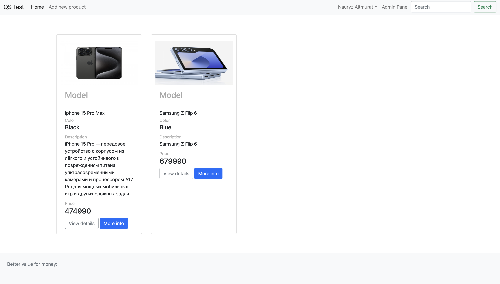
    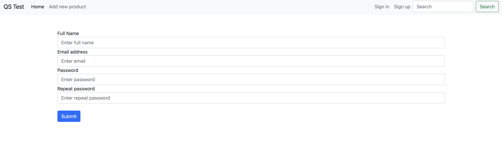
    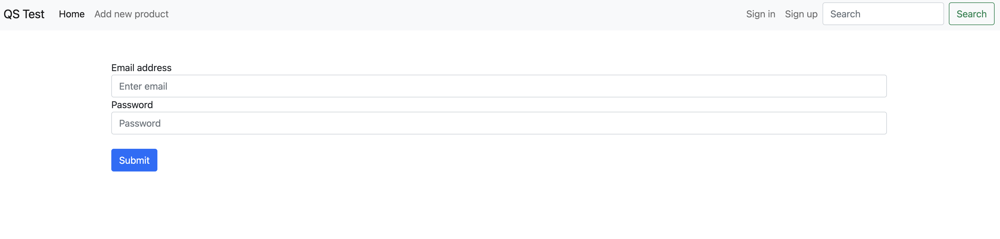
    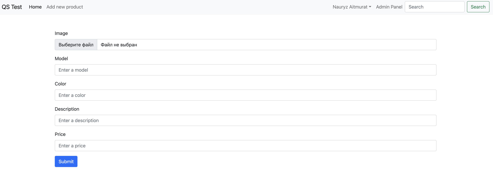
    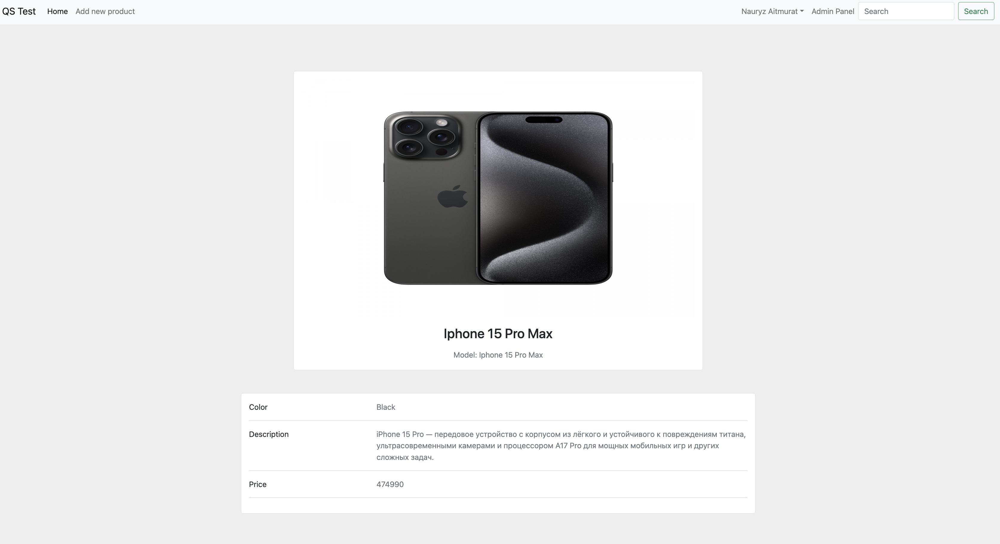
    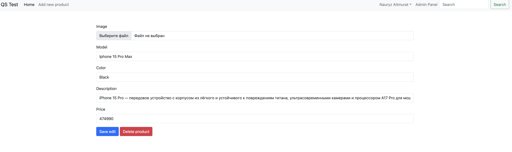
    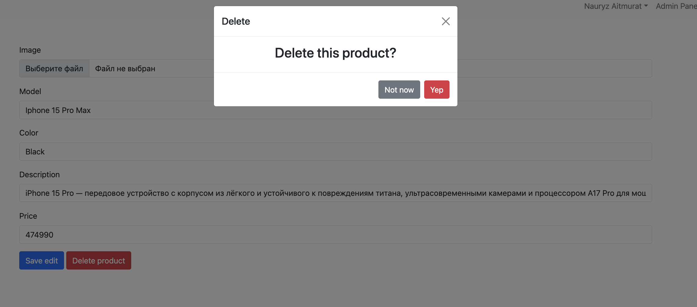
    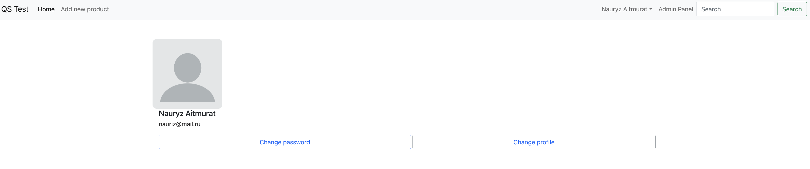
    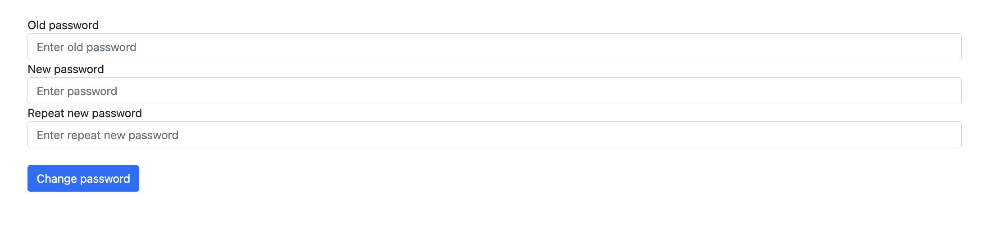
    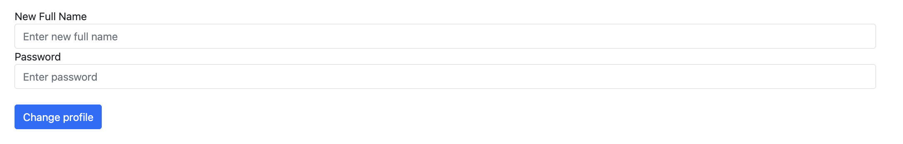
    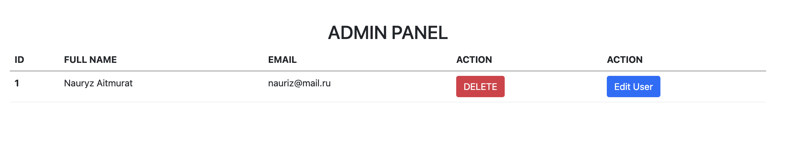

## License
This project is licensed under the [MIT License](LICENSE.md).
